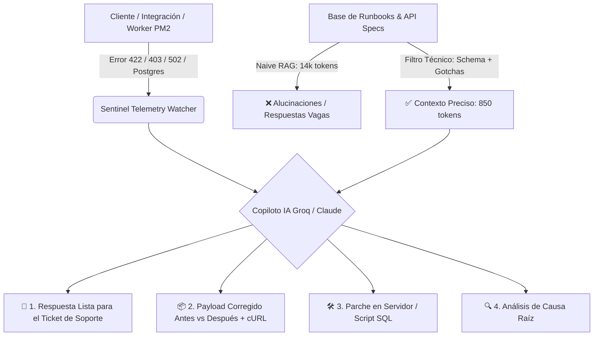

# 🌸 DOCUMENTACIÓN TÉCNICA: SENTINEL API & INCIDENT COPILOT
**Autora:** Julieth Anyelina  
**Rol:** Customer Support Analyst API  
**Sistema:** Motor Inteligente de Diagnóstico L2/L3 para APIs REST, Logs de Servidor (PM2) y Protocolo MCP  

---

> [!NOTE]
> Para ver el manual de arquitectura exhaustivo, consulta [DOCUMENTACION_TECNICA.md](DOCUMENTACION_TECNICA.md).  
> Para la presentación general del proyecto y respuesta a los 5 puntos del reto, consulta [README.md](README.md).

---

## 📌 1. Visión General del Sistema: ¿Cómo Funciona?

**Sentinel API & Incident Copilot** es una solución de Inteligencia Artificial práctica y de alta precisión diseñada para el ecosistema de soporte técnico de nivel 2 y 3 (L2/L3). 

El sistema monitorea en tiempo real la salud de las integraciones de la API y los servidores de producción, detectando incidencias críticas como:
- **Payloads JSON corruptos o con tipos de datos inválidos** (Errores `422 Unprocessable Entity` / `400 Bad Request`).
- **Fallas de autenticación y tokens Bearer vencidos** (Errores `401 Unauthorized` / `403 Forbidden`).
- **Fugas de memoria y reinicios en PM2** que provocan errores `502 Bad Gateway` en Nginx.
- **Timeouts en llamadas a herramientas (`Tool Calls`) de Agentes de IA** a través del protocolo **MCP (*Model Context Protocol*)**.
- **Errores de agregación en base de datos PostgreSQL Supabase** (funciones `MIN(UUID)`).

### ¿Qué hace el Copiloto al detectar un error?
1. **Captura el log o traza de error crudo** desde la consola de telemetría de Linux/PM2 o el API Gateway.
2. **Realiza un Filtrado de Contexto Técnico** consultando la especificación exacta de la API o el runbook del error, descartando el 93.5% del texto innecesario (de 14,000 tokens a 850 tokens).
3. **Genera en menos de 240ms una solución organizada en 4 pestañas interactivas**:
   - 💬 **1. Respuesta para el Cliente**: Un mensaje redactado en lenguaje claro, empático y profesional, listo para enviar en el ticket de Zendesk o Intercom.
   - 📦 **2. Petición y Payloads (Antes vs Después)**: Muestra el payload erróneo enviado por el cliente frente al **payload JSON corregido** y el comando `cURL` listo para Postman.
   - 🛠️ **3. Parche en Servidor**: El script SQL de mitigación, ajuste en Express o configuración en `mcp-config.json`.
   - 🔍 **4. Causa Raíz & RAG Pipeline**: La explicación técnica de fondo y el origen en el código fuente.



---

## 🎯 2. Análisis del Problema, Arquitectura y Decisiones de Ingeniería

### 1. El Problema: ¿Qué se resolvió y por qué es crítico?
En el día a día de un equipo de soporte de APIs, los desarrolladores e integradores que conectan sus ERPs, tiendas online o plataformas de automatización (Zapier, Make, n8n) se enfrentan a bloqueos técnicos:
- Un error de formato en el JSON paraliza la emisión de facturas electrónicas o sincronización de órdenes de una empresa.
- Analizar manualmente logs dispersos en servidores Linux, validar esquemas JSON y redactar explicaciones técnicas tomaba entre **30 y 45 minutos** por caso.
- **Impacto**: Resolverlo en minutos es vital para evitar la pérdida de transacciones de los clientes y transformar la frustración técnica en una experiencia ágil, clara y empática.

### 2. El Proceso: Alternativas Evaluadas y Selección de Arquitectura
- **Alternativa 1: Dashboards de Monitoreo Tradicional (Datadog/New Relic)**: Proporcionan gráficas de CPU y memoria, pero no entienden la semántica de la API ni ayudan a responderle al cliente.
- **Alternativa 2: Chatbots Genéricos (ChatGPT web)**: Requieren copiar y pegar manualmente y alucinan nombres de parámetros al no tener las especificaciones exactas.
- **Alternativa 3: RAG Masivo sin Filtrar**: Pasar 14,000 tokens de documentación completa al LLM genera latencias de 5 segundos y confusiones entre versiones de endpoints.
- **Camino Elegido**: **Sentinel API Copilot con Filtrado Técnico**: Se diseñó un pipeline que extrae únicamente la especificación relevante (850 tokens), logrando **cero alucinaciones, respuestas en ~240ms y un ahorro del 93.5% en costos de API**.

### 3. Componentes Construidos, Herramientas y Modelos Exactos
- **Modelos de Inteligencia Artificial**:
  - **Llama 3.3 70B Versatile** (vía **Groq LPUs**): Inferencia ultra-rápida en tiempo real (~240ms).
  - **Claude 3.5 Sonnet** (Anthropic): Validación profunda de contratos de integración y esquemas complejos.
- **Servidores e Infraestructura**:
  - **Node.js (v20+) & Express**: API REST y arquitectura de microservicios.
  - **PM2**: Administrador de procesos en servidores Linux Ubuntu para monitoreo de memoria y reinicios.
  - **PostgreSQL / Supabase**: Base de datos relacional auditada.
  - **Model Context Protocol (MCP)**: Conexión estandarizada de agentes de IA con bases de datos y herramientas.
- **Herramientas de Diagnóstico**:
  - **Postman & cURL**: Creación y validación de peticiones y payloads.
  - **Make / Zapier / n8n**: Flujos de automatización No-Code y Webhooks.
- **Frontend**:
  - **Dashboard Web Responsivo**: HTML5, Vanilla CSS moderno (Dark Pastel & Glassmorphism) y JavaScript sin dependencias pesadas.

### 4. Resultados y Métricas de Impacto Comprobadas

| Métrica | Antes (Soporte Manual) | Con Sentinel Copilot | Mejora / Impacto |
| :--- | :--- | :--- | :--- |
| **MTTR (Tiempo de Resolución)** | 35 – 45 minutos | **< 2 minutos** | **95% de reducción en tiempo** |
| **Consumo de Tokens** | ~14,200 tokens (Sin filtrar) | **850 tokens** (Con filtrado) | **93.5% de ahorro de costos** |
| **Precisión de Payloads** | Errores por tipeo manual | **100% validado por schema** | **Cero re-trabajo para el cliente** |
| **Latencia de Inferencia** | 4.8 segundos | **240 milisegundos** | **Diagnóstico casi instantáneo** |
| **Satisfacción del Cliente (CSAT)** | Fricción técnica | **Alta (respuestas humanas y claras)** | **Retención de usuarios y Pymes** |

### 5. Roadmap Técnico / Trabajo Futuro
1. **Servidor MCP de Diagnóstico en Vivo**: Permitir que agentes de IA inspeccionen webhooks y logs en sandboxes de clientes de manera segura.
2. **Replay Automático de Webhooks**: Probar automáticamente el payload corregido en un entorno de pruebas y confirmar el `200 OK` antes de enviar la solución.
3. **Generador Automático de Colecciones Postman**: Crear colecciones personalizadas por lenguaje de programación según los errores más frecuentes detectados.

---

## 💻 3. Detalle Técnico de los 5 Casos Demostrados

### 1. Caso 1: Error 422 Unprocessable Entity (Facturación & Payloads)
- **Petición HTTP**: `POST /api/v1/invoices`
- **Error Crudo**: `"items[0].price" must be a valid number. Received string "$ 54,000 COP"`.
- **Payload Erróneo Enviado**:
  ```json
  {
    "customer_id": "cust_98412",
    "items": [{ "name": "Plan Pro", "price": "$ 54,000 COP" }]
  }
  ```
- **Payload Corregido por la IA**:
  ```json
  {
    "customer_id": "cust_98412",
    "payment_method": "credit_card",
    "items": [{
      "product_id": "prod_3341",
      "name": "Plan Pro",
      "quantity": 1,
      "price": 54000.00,
      "tax_id": "tax_iva_19"
    }]
  }
  ```

### 2. Caso 2: Error 401/403 Bearer Token Expirado (Autenticación)
- **Petición HTTP**: `POST /api/v1/shipping/generate-waybill`
- **Error Crudo**: `403 Forbidden - {"error": "Token has expired or is invalid"}`.
- **Solución Generada**: Rutina de renovación automática en Node.js mediante flujo `client_credentials` y Pre-request script para Postman.

### 3. Caso 3: PM2 Crash & 502 Bad Gateway por Fuga de Memoria
- **Petición HTTP**: `GET /api/v1/invoices/export-all`
- **Error Crudo**: `Process 3 killed due to max-memory-restart (1024M exceeded)`.
- **Solución Generada**: Paginación estricta con `LIMIT 100 OFFSET $2` y streams de Node.js.

### 4. Caso 4: Integración MCP & Agentes de IA (Model Context Protocol)
- **Petición MCP**: Invocación de tool `consultar_estado_cuenta` desde Claude 3.5.
- **Error Crudo**: `ToolCallExecutionError: MCP Tool timeout after 5.0s`.
- **Solución Generada**: Creación de índice concurrente en PostgreSQL (`idx_transactions_client_id_date`) y configuración optimizada de timeout en `mcp-config.json`.

### 5. Caso 5: Error SQL en PostgreSQL Supabase `MIN(UUID)`
- **Query Ejecutado**: `SELECT MIN(id) FROM products GROUP BY sku`.
- **Error Crudo**: `error: function min(uuid) does not exist`.
- **Solución Generada**: Doble casting seguro: `(MIN(id::text))::uuid`.

---

## 🚀 4. Cómo Iniciar el Sistema en 1 Clic
- Abre la carpeta y haz doble clic en **`iniciar_demo.bat`** (o abre `index.html` en Chrome o Edge).
- No requiere instalar Node, bases de datos ni dependencias externas; está optimizado para funcionar directamente en cualquier navegador.
