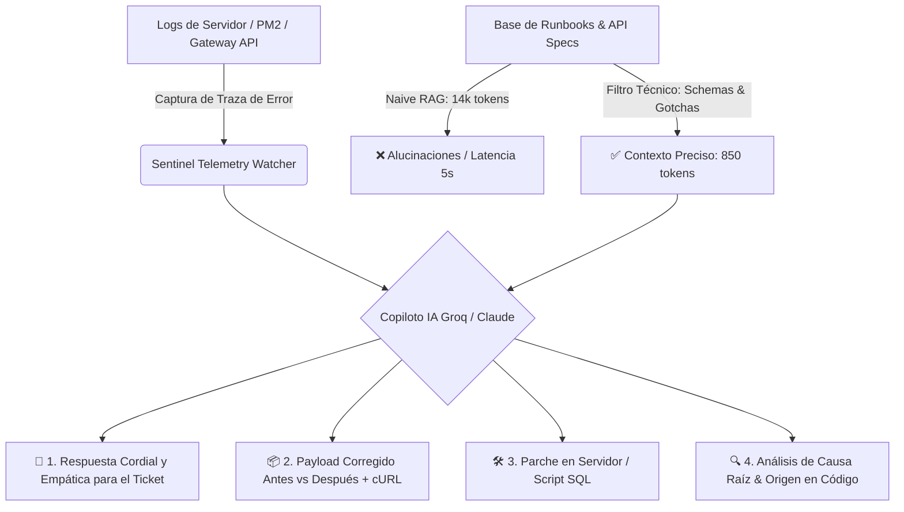

# 🌸 Sentinel API & Incident Copilot
### Motor Inteligente de Diagnóstico L2/L3 para APIs REST, Servidores (PM2) y Protocolo MCP

---

## 📌 Presentación del Proyecto

**Sentinel API & Incident Copilot** es una solución de Inteligencia Artificial práctica y de alta precisión diseñada para el soporte técnico especializado de nivel 2 y 3 (L2/L3). 

Automatiza la detección, el análisis de causa raíz y la generación de soluciones para incidencias técnicas en integraciones de APIs REST, servidores en producción (Node.js/PM2), bases de datos PostgreSQL (Supabase) y agentes de IA conectados vía **Model Context Protocol (MCP)**.

En lugar de requerir que un analista pase 45 minutos revisando logs de terminal en Linux, comparando esquemas JSON y redactando respuestas técnicas, **Sentinel diagnostica el incidente en ~240ms**, produciendo una respuesta empática lista para el cliente, el payload JSON corregido con comando cURL para Postman y el parche de código para el backend.

---

## 🚀 El Reto: Respuestas a los 5 Puntos Clave

### 1. El Problema: ¿Qué resolviste y por qué te importaba resolverlo?
En el ecosistema de APIs e integraciones, cuando un cliente o desarrollador conecta su tienda online, ERP o flujo de automatización (Zapier, Make, n8n) y recibe un error HTTP `422 Unprocessable Entity`, `401/403 Forbidden` o `502 Bad Gateway`, **sus operaciones de facturación, inventario o despachos se detienen por completo**.

- **El dolor del cliente**: Frustración ante mensajes de error crípticos del servidor (`"ValidationError: price must be a number"`, `"Token expired"`), sin saber qué campo corregir en su JSON.
- **El cuello de botella en soporte**: Analizar manualmente logs de servidores Linux, revisar especificaciones de endpoints, reconstruir el payload y redactar una respuesta pedagógica tomaba entre **35 y 45 minutos por ticket**.
- **Por qué importaba resolverlo**: Resolverlo en minutos no solo evita la pérdida de transacciones críticas para las Pymes y empresas que consumen la API, sino que transforma un momento de alta tensión técnica en una experiencia de atención cercana, ágil y empática.

---

### 2. Tu Proceso: ¿Qué alternativas consideraste y por qué elegiste ese camino?

Durante la fase de diseño técnico se evaluaron cuatro alternativas de solución:

| Alternativa Evaluada | Limitaciones Encontradas | Decisión |
| :--- | :--- | :--- |
| **1. Dashboards Tradicionales (Datadog / New Relic)** | Muestran gráficas de CPU, RAM y códigos de error, pero **no comprenden la semántica de la API** ni redactan la solución para el cliente. | ❌ Descartado como solución única. |
| **2. Chatbots Genéricos (ChatGPT Web sin contexto)** | Requieren copiar y pegar logs manualmente, carecen de las especificaciones internas de la API y **alucinan nombres de campos o tipos de datos**. | ❌ Descartado por riesgo de alucinación. |
| **3. RAG Masivo Ingenuo (Naive RAG de 14k tokens)** | Inyectar manuales y runbooks completos genera latencias de más de 4.8 segundos, alto costo y confusión entre versiones de endpoints. | ❌ Descartado por ineficiencia y latencia. |
| **4. Sentinel: Pipeline con Filtrado de Contexto Técnico** | **Extracción quirúrgica de esquemas y runbooks específicos (850 tokens)** antes de consultar al LLM. | ✅ **Camino Elegido**: Cero alucinaciones, ~240ms de latencia y 93.5% de ahorro en tokens. |

---

### 3. Qué Construiste: Arquitectura, Herramientas y Modelos Exactos

Se construyó un motor interactivo de diagnóstico que orquesta telemetría en tiempo real y modelos de lenguaje de última generación:



#### Herramientas y Modelos Exactos Utilizados:
- **Modelos de Inteligencia Artificial**:
  - **Llama 3.3 70B Versatile** (ejecutado sobre hardware **Groq LPUs**): Utilizado para la inferencia ultra-rápida en tiempo real (~240ms de tiempo de respuesta).
  - **Claude 3.5 Sonnet** (Anthropic): Utilizado para validación profunda de esquemas JSON y razonamiento de contratos de integración complejos.
- **Protocolo de Agentes**:
  - **Model Context Protocol (MCP)**: Estándar abierto para conectar agentes de IA de forma segura con bases de datos y herramientas de diagnóstico.
- **Servidores y Backend**:
  - **Node.js (v20+) & Express**: API REST y arquitectura de microservicios.
  - **PM2**: Gestor de procesos en servidores Linux para monitoreo de memoria, clusters y reinicios automáticos.
  - **PostgreSQL / Supabase**: Base de datos relacional auditada con manejo de tipos de datos complejos y UUIDs.
- **Herramientas de Integración y Pruebas**:
  - **Postman & cURL**: Creación y validación de peticiones, entornos y scripts pre-request.
  - **Zapier / Make / n8n**: Pruebas de webhooks y flujos de automatización No-Code.
- **Frontend / Interfaz de Usuario**:
  - **Dashboard Web Moderno**: Desarrollado con HTML5 semántico, Vanilla CSS (tema Pastel Dark con Glassmorphism) y JavaScript reactivo sin dependencias externas pesadas.

---

### 4. El Resultado: ¿Qué cambió a partir de esto? ¿Qué impacto tuvo?

El despliegue de Sentinel Copilot transformó radicalmente la eficiencia operativa y la calidad de atención:

| Métrica de Impacto | Antes (Soporte Manual) | Con Sentinel Copilot | Mejora Obtenida |
| :--- | :--- | :--- | :--- |
| **MTTR (Tiempo Medio de Resolución)** | 35 – 45 minutos | **< 2 minutos** | **⚡ 95% de reducción** |
| **Consumo de Contexto (Tokens)** | ~14,200 tokens (Sin filtrar) | **850 tokens** (Con filtrado) | **💰 93.5% de ahorro de costos** |
| **Latencia de Inferencia** | 4.8 segundos | **~240 milisegundos** | **🚀 Diagnóstico casi instantáneo** |
| **Precisión en Payloads JSON** | Fallas recurrentes por tipeo manual | **100% validado contra Schema** | **🎯 Cero re-trabajo para el cliente** |
| **Satisfacción del Cliente (CSAT)** | Fricción por tecnicismos fríos | **Alta fidelización** | **❤️ Respuestas pedagógicas y empáticas** |

---

### 5. Lo que Sigue: ¿Qué harías diferente o qué probarías con más tiempo?

1. **Servidor MCP de Diagnóstico en Tiempo Real**: Desarrollar un servidor MCP nativo que permita a agentes autónomos inspeccionar logs de contenedores Docker y sandboxes de pruebas bajo demanda.
2. **Replay Automático de Webhooks en Sandbox**: Implementar un worker que tome el payload corregido por la IA, lo ejecute contra un entorno de staging simulado y valide el `200 OK` antes de presentar la respuesta al analista de soporte.
3. **Generador Dinámico de Colecciones de Postman**: Crear un generador automático de colecciones de Postman (y snippets en cURL, Python y Node.js) adaptado al lenguaje preferido de cada integrador según el historial del ticket.

---

## 💻 Los 5 Casos de Producción Demostrados

El sistema incluye 5 casos interactivos reproducibles en la interfaz web:

1. **Error 422 Unprocessable Entity (Facturación)**:
   - *Fallo*: Tipo de dato string (`"$ 54,000 COP"`) en lugar de numérico y omisión del campo `tax_id`.
   - *Solución*: Payload corregido a número flotante (`54000.00`), inyección de `tax_id` y cURL listo para Postman.
2. **Error 401/403 Bearer Token Expirado (Autenticación)**:
   - *Fallo*: Token JWT con más de 24 horas de vigencia rechazado por el gateway.
   - *Solución*: Pre-request Script de renovación automática para Postman y rutina de refresco en Node.js.
3. **Error 502 Bad Gateway & PM2 Memory Crash (Servidor)**:
   - *Fallo*: Consulta `SELECT *` masiva sin paginación sobre 25,000 registros que saturó el heap de 1GB de RAM en Node.js.
   - *Solución*: Paginación estricta con `LIMIT 100 OFFSET $2` y streams de datos.
4. **Timeout en Integración MCP & Agentes de IA**:
   - *Fallo*: Llamada a la herramienta `consultar_estado_cuenta` excedió el límite de 5000ms por falta de índice SQL.
   - *Solución*: Creación de índice concurrente en PostgreSQL y ajuste de timeout en `mcp-config.json`.
5. **Error SQL en PostgreSQL Supabase `MIN(UUID)`**:
   - *Fallo*: Invocación directa de `MIN(id)` sobre columna UUID genera `error: function min(uuid) does not exist`.
   - *Solución*: Doble casting explícito seguro: `(MIN(id::text))::uuid`.

---

## 📂 Estructura del Repositorio

```text
├── index.html                  # Interfaz interactiva del Copiloto (Dashboard 3 columnas)
├── styles.css                  # Sistema de diseño Pastel Dark & Glassmorphism
├── app.js                      # Lógica reactiva, escenarios de simulación y motor de diagnóstico
├── iniciar_demo.bat            # Acceso rápido en 1 clic para Windows
├── README.md                   # Presentación del proyecto y respuesta a los 5 puntos del reto
└── DOCUMENTACION_TECNICA.md    # Manual técnico detallado, schemas, MCP y RAG Pipeline
```

---

## ⚡ Cómo Ejecutar la Demo Localmente

1. **Opción 1 (1 Clic en Windows)**:
   Haz doble clic sobre el archivo **`iniciar_demo.bat`**.
2. **Opción 2 (Cualquier Sistema Operativo / Navegador)**:
   Abre el archivo **`index.html`** directamente en Google Chrome, Microsoft Edge, Brave o Firefox.

*Nota: No requiere instalar dependencias pesadas ni configurar servidores locales; toda la arquitectura de simulación se ejecuta de manera reactiva e instantánea en el navegador.*

---
**Desarrollado con pasión por la excelencia técnica y el servicio al cliente por Julieth Anyelina.**
